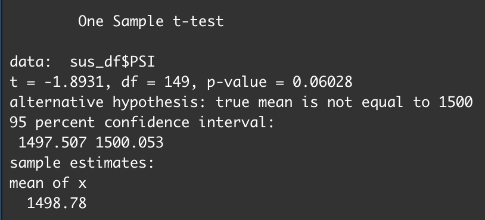

# MechaCar_Statistical_Analysis

---
## Overview

The purpose of this project is to perform statistical analysis to identify which variables in the dataset predict the MPG of the MechaCar prototypes. These insight will then be reviewed to help the manufacturing team.

### Aim

The aim of this paper is to :
 - Perform multiple linear regression analysis to identify which variables in the dataset predict the mpg of MechaCar prototypes
 - Collect summary statistics on the pounds per square inch (PSI) of the suspension coils from the manufacturing lots
 - Run t-tests to determine if the manufacturing lots are statistically different from the mean population
 - Design a statistical study to compare vehicle performance of the MechaCar vehicles against vehicles from other manufacturers.

---
## Linear Regression to Predict MPG

Looking at the results below, the following information can be determined. 

The most sigificant variables in the dataset that provided a non-random amount of variance to the MPG values were Vehicle Length and Ground Clearance, with P-Values of 2.60e-12 and 5.21e-08 respectively. It should also be noted that the intercept is also statistically significant, with a P-Value of 5.08e-08.

As the P-Value is low, at 5.35e-11, the null hypothesis is rejected. The the releationship between MPG and the dataset variables is subject to more than random chance and the slope can't be considered to be zero.

Given an r-sqaured value of 0.7149, this means the linear regression model is about 71% accurate. This gives this model some level of efficacy, however a higher confidence level is preferred. 

---
## Summary Statistics on Suspension Coils

The design specifications for the MechaCar suspension coils dictate that the variance of the suspension coils must not exceed 100 pounds per square inch.

Looking at the total summary, the variance is shown as 62.29, which is below the 100 maximum, and therefore looks to meet expectations. 

 

When looking into specific Lots, it can be seen that Lot 3 has a variance of 170.28 which is greater than the limit of 100, which means Lot 3 does not meet the design specification.

---
## T-Tests on Suspension Coils

### All Lots Test 

Looking at the T-Test for all Lots, it's clear that the coils from all Lots aren't statistically significant as the P-Value is 0.06028, which isn't low enough to reject the Null Hypothesis.

### Lot 1 Test

With a P-Vlaue of 1 Lot 1 is not statistically significant enough to reject the null hypothesis.

### Lot 2 Test

With a P-Vlaue of 0.607 Lot 2 is still slightly too high of a P-Vlaue to reject the null hypothesis.

### Lot 3 Test

With a P-Vlaue of 0.04168 Lot 3 is just below 0.05 meaning the results are statistically significant and we can reject the null hypothesis.

---
## Study Design: MechaCar vs Competition

Using R, a statistical study can be created to compare the performance of the MechaCar vehicles against performance of vehicles from other manufacturers. When looking at the performance of a car, many specs could be used, such as engine power, speed, agility, driving experience, among many. Maintenance cost is also very important for car performance, so this could be a good measure to use. 

#### Metric to Test
In this study we'll analyze MechaCar's average yearly maintenance cost in comparison to the competition.

#### Null Hypothesis
MechaCar's average yearly maintenance cost is similar to competitor's vehicles.

#### Alternative Hypothesis
MechaCar's average yearly maintenance cost is statistically lower than the competition.

#### Statistical Test Used
A two-sample t-test would be the best statistical test to use as we are testing for the difference between the distribution from two samples but for one variable.

#### What data is needed
Data that would need to be collected woudl be the average maintenance cost of all MechaCars over the course of 5 years, alongside major competitor's maintenance costs.
